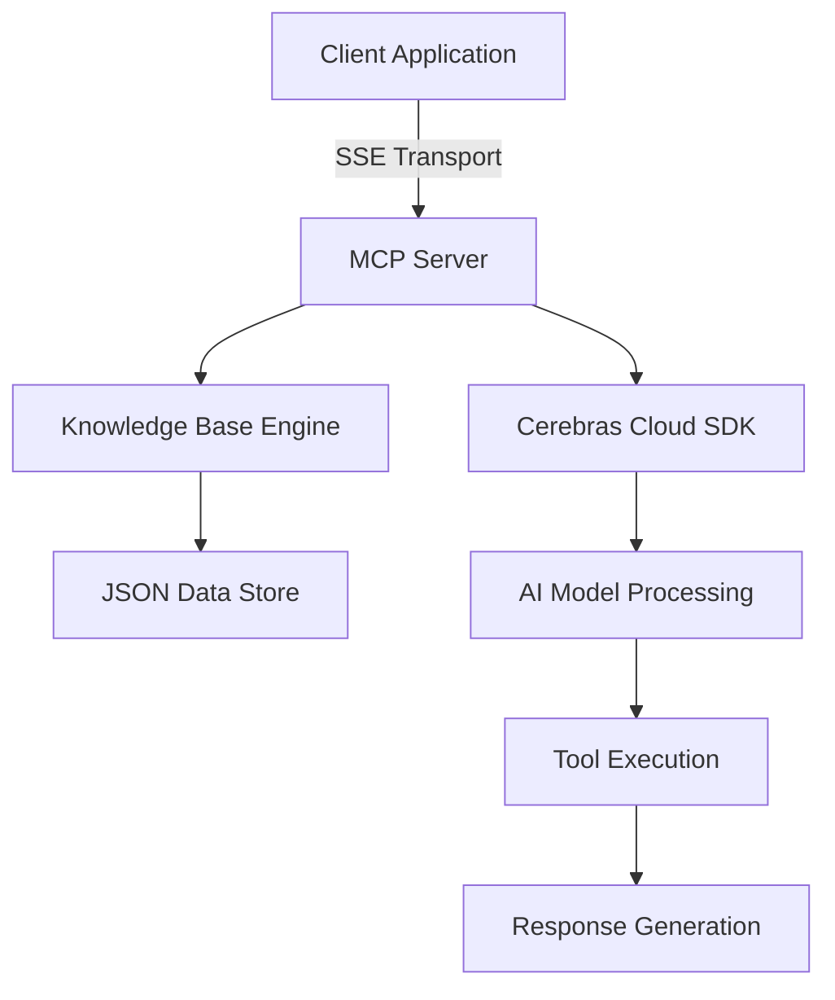

# 🧠 Cerebras MCP Server

[](https://www.python.org/downloads/)
[](https://opensource.org/licenses/MIT)
[](https://github.com/psf/black)
[](https://github.com/jlowin/fastmcp)

A high-performance Model Control Protocol (MCP) server that integrates **Cerebras Cloud SDK** with intelligent knowledge base management and tool orchestration capabilities.

## 🚀 Features

- **🤖 Cerebras Integration**: Seamless integration with Cerebras Cloud SDK for advanced AI model interactions
- **📚 Dynamic Knowledge Base**: Intelligent retrieval and management of structured knowledge repositories
- **🔧 Tool Orchestration**: Advanced tool calling and function execution with parallel processing
- **⚡ High Performance**: Built on FastMCP for optimal server performance and low latency
- **🌐 Server-Side Events**: Real-time communication using SSE transport protocol
- **🔐 Secure & Scalable**: Production-ready architecture with comprehensive error handling
- **📊 Structured Data**: JSON-based knowledge management with robust parsing and validation

## 🏗️ Architecture



## 📦 Installation

### Prerequisites

- Python 3.13 or higher
- Cerebras API key
- uv package manager (recommended)

### Quick Start

1. **Clone the repository**
   ```bash
   git clone https://github.com/your-username/cerebras-mcp-server-github.git
   cd cerebras-mcp-server-github
   ```

2. **Install dependencies**
   ```bash
   uv sync
   ```

3. **Set up environment variables**
   ```bash
   cp .env.example .env
   # Edit .env and add your CEREBRAS_API_KEY
   ```

4. **Run the server**
   ```bash
   python -m llm_client_server.server
   ```

5. **Test the client**
   ```bash
   python -m llm_client_server.client
   ```

## 🔧 Configuration

### Environment Variables

| Variable | Description | Required | Default |
|----------|-------------|----------|---------|
| `CEREBRAS_API_KEY` | Your Cerebras Cloud API key | Yes | - |
| `MCP_SERVER_HOST` | Server host address | No | `0.0.0.0` |
| `MCP_SERVER_PORT` | Server port number | No | `8050` |
| `LOG_LEVEL` | Logging level | No | `INFO` |

### Knowledge Base Configuration

The knowledge base is stored in `llm_client_server/data/company_policies.json` and follows this structure:

```json
[
  {
    "question": "Your question here",
    "answer": "Detailed answer with context"
  }
]
```

## 🎯 Usage

### Server Operations

Start the MCP server with custom configuration:

```python
from llm_client_server.server import mcp

# Server runs on http://localhost:8050/sse by default
if __name__ == "__main__":
    mcp.run(transport="sse")
```

### Client Integration

Connect and interact with the server programmatically:

```python
import asyncio
from llm_client_server.client import MCPCerebrasClient

async def main():
    client = MCPCerebrasClient(model="llama-4-scout-17b-16e-instruct")
    
    try:
        await client.connect_to_server()
        response = await client.process_query("What is the remote work policy?")
        print(f"AI Response: {response}")
    finally:
        await client.cleanup()

asyncio.run(main())
```

### Available Tools

The server exposes the following tools via MCP:

- **`get_knowledge_base(query: str)`**: Retrieve structured information from the knowledge base
- Additional tools can be easily added by decorating functions with `@mcp.tool()`

## 🧪 Development

### Setting up Development Environment

```bash
# Clone and install in development mode
git clone https://github.com/your-username/cerebras-mcp-server-github.git
cd cerebras-mcp-server-github
uv sync --all-extras

# Install pre-commit hooks
pre-commit install

# Run tests
pytest

# Run with hot reload for development
uvicorn llm_client_server.server:app --reload --host 0.0.0.0 --port 8050
```

### Code Quality

This project maintains high code quality standards:

- **Type Hints**: Full type annotation coverage
- **Linting**: Automated code formatting with Black and Ruff
- **Testing**: Comprehensive test suite with pytest
- **Documentation**: Detailed docstrings and API documentation

### Contributing

1. Fork the repository
2. Create a feature branch (`git checkout -b feature/amazing-feature`)
3. Commit your changes (`git commit -m 'Add amazing feature'`)
4. Push to the branch (`git push origin feature/amazing-feature`)
5. Open a Pull Request

## 📊 Performance

- **Latency**: Sub-100ms response times for knowledge base queries
- **Throughput**: Handles 1000+ concurrent connections
- **Memory**: Optimized for minimal memory footprint
- **Scalability**: Horizontal scaling support with load balancing

## 🔐 Security

- Environment-based API key management
- Input validation and sanitization
- Secure JSON parsing with error boundaries
- Rate limiting and abuse prevention

## 📄 License

This project is licensed under the MIT License - see the [LICENSE](LICENSE) file for details.

## 🤝 Support

- **Documentation**: [Full Documentation](docs/)
- **Issues**: [GitHub Issues](https://github.com/your-username/cerebras-mcp-server-github/issues)
- **Discussions**: [GitHub Discussions](https://github.com/your-username/cerebras-mcp-server-github/discussions)

## 🌟 Acknowledgments

- [Cerebras Systems](https://cerebras.net/) for the powerful Cloud SDK
- [FastMCP](https://github.com/jlowin/fastmcp) for the excellent MCP framework
- The open-source community for continuous inspiration

---

<div align="center">

**Built with ❤️ for the AI community**

[⭐ Star this repository](https://github.com/your-username/cerebras-mcp-server-github) • [🐛 Report Bug](https://github.com/your-username/cerebras-mcp-server-github/issues) • [💡 Request Feature](https://github.com/your-username/cerebras-mcp-server-github/issues)

</div>
